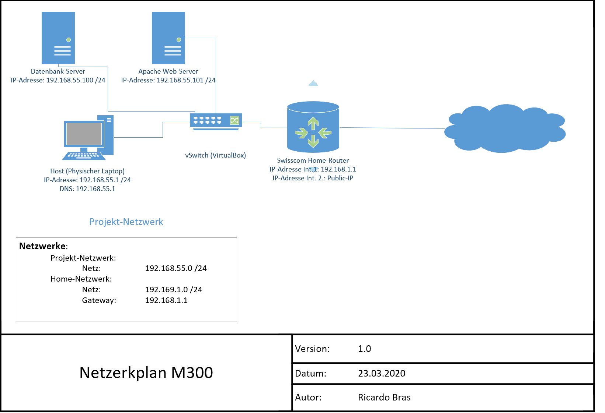
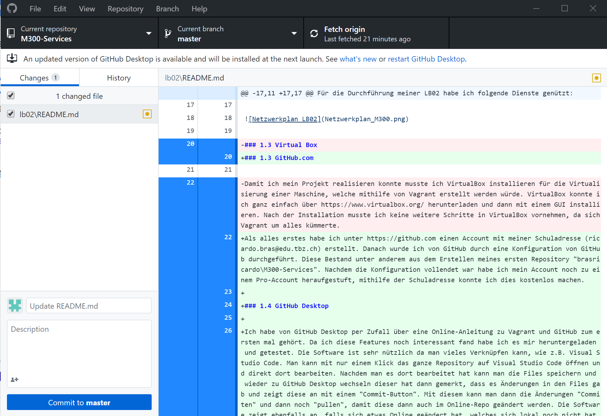
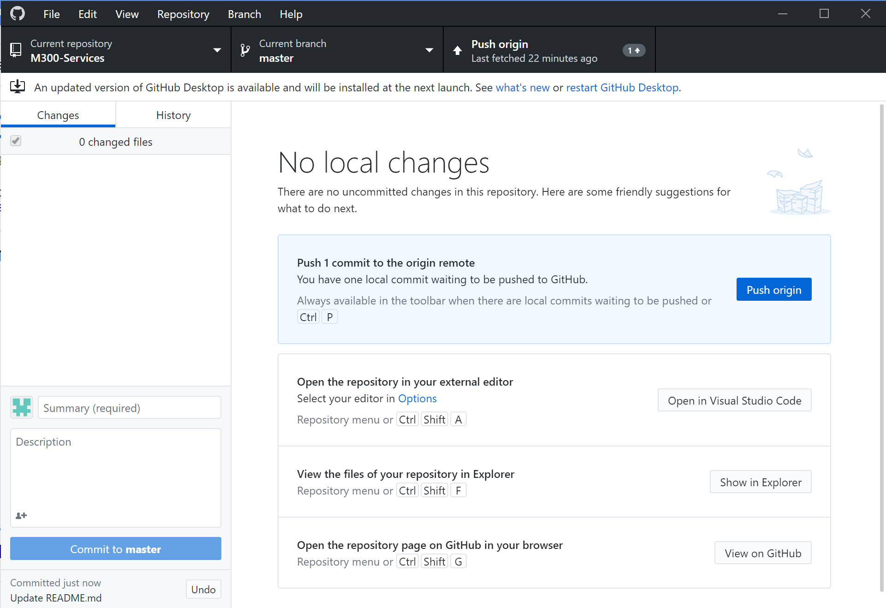

# M300

## 1. Information

### 1.1 Beschreibung
Für die Durchführung meiner LB02 habe ich folgende Dienste genützt:

- GitHub.com
- GitHub Desktop
- Git-Client (SSH-Key)
- Vagrant
- VirtualBox
- Visual Studio Code


### 1.2 Netzwerkplan



### 1.3 GitHub.com

Als alles erstes habe ich unter https://github.com einen Account mit meiner Schuladresse (ricardo.bras@edu.tbz.ch) erstellt. Danach wurde ich von GitHub durch eine Konfiguration von GitHub durchgeführt. Diese Bestand unter anderem aus dem Erstellen meines ersten Repository "brasricardo\M300-Services". Nachdem die Konfiguration vollendet war habe ich mein Account noch zu einem Pro-Account heraufgestuft, mithilfe der Schuladresse konnte ich dies kostenlos machen.

### 1.4 GitHub Desktop

Ich habe von GitHub Desktop per Zufall über eine Online-Anleitung zu Vagrant und GitHub zum ersten mal gehört. Da ich diese Features noch interessant fand habe ich es mir heruntergeladen und getestet. Die Software ist sehr nützlich da man vieles Verknüpfen kann, wie z.B. Visual Studio Code. Man kann mit nur einem Klick das ganze Repository auf Visual Studio Code öffnen und direkt dort bearbeiten. Nachdem man es dort bearbeitet hat kann man die Files speichern und wieder zu GitHub Desktop wechseln dieser hat dann gemerkt, dass es Änderungen in den Files gab und zeigt diese an mit einem "Commit-Button". Mit diesem kann man dann die Änderungen "Commiten" und dann noch "pullen", damit diese dann auch im Online-Repo geändert werden. Die Software zeigt ebenfalls an, falls sich etwas Online geändert hat, welches sich lokal noch nicht hat und zeigt dann einen "Push-Button" an, mit dem man die Online-Änderungen auf das lokale Repository speichern kann. 





### 1.5 Git-Client

Mit Git-Client konnte ich die Git-Befehle auf meinem lokalen Client auf einem Bash eingeben. Diese Bash ist nichts anderes als eine Linux-Bash mit der man Git-Befehle ausführen kann. Ich habe sie nicht oft gebraucht, da ich hauptsächlich mit GitHub Desktop gearbeitet habe. Jedoch habe ich sie am Anfang für die Erstellung eines Private & Public Key gebraucht, welches ich dann mit GitHub verbunden habe, damit man sich nicht immer anmelden muss

```
$  ssh-keygen -t rsa -b 4096 -C "beispiel@beispiel.com"     #Danach der Konfiguration folgen und abschliessen.
```

Nachdem die Keys erstellt wurden musste ich den Inhalt des Public-Keys kopieren und dies in meinem GitHub Profil unter Settings und SSH & GPS Keys einfügen und abspeichern.


### 1.6 Vagrant

Ich habe gelernt, dass mithilfe von Vagrant die Installation und erst Konfiguration von VMs sehr einfach und unkompliziert funktionieren kann. Damit ich Vagrant nutzen konnte habe ich es von https://www.vagrantup.com/ heruntergeladen und auf meinem Client installiert. Nachdem die Installation abgeschlossen war konnte man bereits loslegen. Ich habe in mein Verzeichnis gewechselt, welches sich unter C:\Users\Ricardo\M300 befindet. Dieses Verzeichnis ist ein "Clone" meines GitHub-Repository. 

Mit Vagrant konnte ich dann eine VM erstellen, konfigurieren und starten.

```
$ vagrant init ubuntu/xenial64        #Vagrantfile erzeugen
$ vagrant up --provider virtualbox    #Virtuelle Maschine erstellen & starten
```

Sobald die Installation zu ende ist und keine Fehler vorgekommen sind, läuft die Maschine und man kann per CMD eine SSH-Verbindung zu dieser herstellen.

```
vagrant ssh
```

Falls man eine bereits erstellte VM löschen möchte kann dies ganz einfach mit folgendem Befehl durchgeführt werden:

```
vagrant destroy -f
```

Der Inhalt des Vagrantfiles (Konfiguration) kann grob unter dem Punkt 2.Konfiguration und https://github.com/brasricardo/M300-Services/tree/master/lb02/lam gefunden werden.

### 1.7 Virtual Box

Damit ich mein Projekt realisieren konnte musste ich VirtualBox installieren für die Virtualisierung einer Maschine, welche mithilfe von Vagrant erstellt werden würde. VirtualBox konnte ich ganz einfach über https://www.virtualbox.org/ herunterladen und dann mit einem GUI installieren. Nach der Installation musste ich keine weitere Schritte in VirtualBox vornehmen, da sich Vagrant um alles kümmerte.

### 1.8 Visual Studio Code

Visual Studio Code ermöglicht es mir mein Vagrant- oder die README-Files ganz einfach über einen Code-Editor übersichtlich und gut zu gestalten und schreiben. 

## 2. Dokumentation

### 2.1 Vagrantfile

*Database*
```
# Every Vagrant virtual environment requires a box to build off of.
  config.vm.define "database" do |db|
    db.vm.box = "ubuntu/xenial64"
	db.vm.provider "virtualbox" do |vb|
	  vb.memory = "512"  
	end
    db.vm.hostname = "db01"
    db.vm.network "private_network", ip: "192.168.55.100"
    # MySQL Port nur im Private Network sichtbar
	# db.vm.network "forwarded_port", guest:3306, host:3306, auto_correct: false
	#path: "db.sh"
	  db.vm.provision "shell", inline: <<-SHELL
	  sudo apt update
	  sudo apt upgrade

		# ---------------------------------------
		#          MySQL Setup
		# ---------------------------------------

		# Setting MySQL root user password root/root
		sudo debconf-set-selections <<< 'mysql-server mysql-server/root_password password Admin1234'
		sudo debconf-set-selections <<< 'mysql-server mysql-server/root_password_again password Admin1234'


		# Installing packages
		sudo apt-get install -y mysql-server mysql-client

		# Allow External Connections on your MySQL Service
		sudo sed -i -e 's/bind-addres/#bind-address/g' /etc/mysql/mysql.conf.d/mysqld.cnf
		sudo sed -i -e 's/skip-external-locking/#skip-external-locking/g' /etc/mysql/mysql.conf.d/mysqld.cnf
		mysql -u root -proot -e "GRANT ALL PRIVILEGES ON *.* TO 'root'@'%' IDENTIFIED BY 'Admin1234' WITH GRANT OPTIONS; CREATE USER 'database'@'%' IDENTIFIED BY 'DBuser1234'; GRANT SELECT ON *.* TO 'database'@'%' IDENTIFIED BY 'DBuser1234; FLUSH privileges;"
		sudo service mysql restart
		# create client database
		mysql -u root -pAdmin1234 -e "CREATE DATABASE Test;"


		# Firewall configuration
		sudo ufw -f enable
		sudo ufw deny out to any
		sudo ufw allow from 192.168.55.1 to any port 22
        sudo ufw allow from 192.168.55.101 to any port 22
		sudo ufw allow from 192.168.55.101 to any port 3306
	SHELL
  end
```

Mit diesem Script wurde die Erstellung und die Konfiguration von einem MySQL-Server und Firewalleinstellungen durchgeführt. Für den Databaseserver wurde ebenfalls noch ein SSH-Key erstellt, damit dies eine sichere Verbindung zum Webserver aufbauen, dies wurde jedoch manuell durchgeführt (Weiteres kann unter Sicherheitsmassnahmen gefunden werden). Am Anfang des Scriptes wurden ein paar VM-Komponenten definiert, wie z.B. Name der VM, was für ein Betriebssystem, wie viel memory, IP-Adresse und forwarded Ports. Im nächsten Teil wird noch gesorgt, dass das Betriebssystem auf dem neustem Stand ist bevor die Installation und Konfigruation durchgefürht wird. Nachdem das System auf dem neustem Stand ist wird noch das Root Passwort auf "Admin1234" definiert und danach kann die Installation beginnen. Nach der Installation werden noch ein paar Einträge in der Konfig Datei von MySQL geändert, damit man eine Verbindung von extern zum Server aufbauen kann. Zudem wird dem "root" alle Rechte von überall gegeben und ein zusätzlicher user "database" wird erstellt mit nur leserechte. Danach wird der ganze Service neugestartet und eine "Test"-DB wird erstellt. Zum Schluss wird noch die Firewall konfiguriert, damit eine gewisse Sicherheit gegeben ist (Weitere Infromation/ Dokumentation unter Sicherheitsmassnahmen).


*Webserver*
```
config.vm.define "web" do |web|
    web.vm.box = "ubuntu/xenial64"
    web.vm.hostname = "web01"
    web.vm.network "private_network", ip:"192.168.55.101"
	web.vm.network "forwarded_port", guest:80, host:8080, auto_correct: true
	web.vm.provider "virtualbox" do |vb|
	  vb.memory = "512"  
	end
	# Braucht es hier nicht, weil Standardseite    
  	# web.vm.synced_folder ".", "/var/www/html"  
  	# Wird nur in 1. VM gemountet, Fehler?
  	web.vm.synced_folder ".", "/vagrant"  	
	web.vm.provision "shell", inline: <<-SHELL
		sudo apt-get update
        sudo apt -y upgrade
		sudo apt-get -y install debconf-utils apache2 nmap
		sudo apt-get -y install php libapache2-mod-php php-curl php-cli php-mysql php-gd mysql-client  
		
		#SSL-Certificate
		sudo mkdir /etc/apache2/ssl
		cd /etc/apache2/ssl

		sudo openssl genrsa -out apache.key 4096
		sudo openssl req -new -x509 -key apache.key -out apache.cert -days 3650 -subj /CN=example.com

		sudo sed -i '14iSSLEngine on' /etc/apache2/sites-enabled/000-default.conf
		sudo sed -i '15iSSLCertificateFile /etc/apache2/ssl/apache.cert' /etc/apache2/sites-enabled/000-default.conf
		sudo sed -i '16iSSLCertificateKeyFile /etc/apache2/ssl/apache.key' /etc/apache2/sites-enabled/000-default.conf

		sudo sed -i '1s/.*/<VirtualHost *:433>/' /etc/apache2/sites-enabled/000-default.conf

		sudo sed -i '1i<VirtualHost *:80>' /etc/apache2/sites-enabled/000-default.conf
		sudo sed -i '2iServerName example.com' /etc/apache2/sites-enabled/000-default.conf
		sudo sed -i '3iDocumentRoot /var/www/html' /etc/apache2/sites-enabled/000-default.conf
		sudo sed -i '4iRedirect permanent / https://192.168.55.101/' /etc/apache2/sites-enabled/000-default.conf
		sudo sed -i '5i</VirtualHost>' /etc/apache2/sites-enabled/000-default.conf

		sudo a2enmod ssl
		sudo service apache2 restart

		# Firewall configuration
		sudo ufw -f enable
		sudo ufw deny out to any
		sudo ufw allow 80/tcp
        sudo ufw allow from 192.168.55.100 to any port 22
		sudo ufw allow from 192.168.55.1 to any port 22

		# Admininer SQL UI 
		sudo mkdir /usr/share/adminer
		sudo wget "http://www.adminer.org/latest.php" -O /usr/share/adminer/latest.php
		sudo ln -s /usr/share/adminer/latest.php /usr/share/adminer/adminer.php
		echo "Alias /adminer.php /usr/share/adminer/adminer.php" | sudo tee /etc/apache2/conf-available/adminer.conf
		sudo a2enconf adminer.conf 
		sudo a2enmod cgi
		sudo cp /vagrant/rest /vagrant/restsql /usr/lib/cgi-bin/ && sudo chown www-data /usr/lib/cgi-bin/rest* && sudo chmod 755 /usr/lib/cgi-bin/rest*
		sudo mkdir -p  /var/www/html/data && sudo chown www-data:www-data /var/www/html/data 
		sudo service apache2 restart 
	  echo '127.0.0.1 localhost web01\n192.168.55.100 db01' > /etc/hosts
SHELL
	end  
 end
```
Mit diesem Script wurde die Erstellung und die Konfiguration von einem Apache Webserver mit Adminer und Firewalleinstellungen durchgeführt. Da beim Databaseserver ein SSH-Key generiert wurde wird der public key hier im Webserver eingelesen, damit die sichere Verbindung garantiert werden kann, dies aber ebenfalls manuell (Weiteres kann unter Sicherheitsmassnahmen gefunden werden). Am Anfang des Scriptes wurden ein paar VM-Komponenten definiert, wie z.B. Name der VM, was für ein Betriebssystem, wie viel memory, IP-Adresse und forwarded Ports. Im nächsten Teil wird noch gesorgt, dass das Betriebssystem auf dem neustem Stand ist bevor die Installation und Konfigruation durchgefürht wird. Nachdem das System auf dem neustem Stand werden noch ein paar Sachen für den Apache-Dienst installiert, weie z.B. php. Nach dieser Installation geht es weiter mit dem absichern der Verbindung zum Webserver mithilfe von einem SSL-Zertifikat. Es wird ein Ordner erstellt für die Zertifikate, danach werden diese generiert und sobald diese generiert sind werden noch die Konfigurationsdatei des apache bearbeitet. In dieser Datei wird jeglich der Ort der Zertifikate bestummen und eine Weiterleitung von HTTP zu HTTPS wird noch gemacht. Zum Schluss der Konfiguration des Zertifikates wird noch ein SSL Apachemodul aktiviert und der Apache-Dienst wird neugestartet. Als nächstes wird noch die Firewall konfiguriert, damit eine gewisse Sicherheit gegeben ist (Weitere Infromation/ Dokumentation unter Sicherheitsmassnahmen). Im letzten Schritt wird das Datenbankverwaltungstool Adminer installiert. Dieser wird mithilfe des wget-Befehles heruntergeladen und mit den darauf folgenden Schritten installiert. Am Schluss werden noch die richtigen Rechte den entsprechenden Dateien verteilt und dann wird der Apache-Dienst nochmals neugestartet.

### 2.2 Sicherheihtsmassnahmen

#### 2.2.1 MySQL-User

#### 2.2.2 Firewall Database

#### 2.2.3 SSL-Zertifikat (HTTPS)

#### 2.2.4 Firewall Webserver

### 2.3 Testdokumentation

## 3. Leistungsbeurteilung 01 (LB01)
Diese Beurteilung beinhaltet keine Dokumente, da es sich hier um eine Theorieprüfung handelt.

## 4. Leistungsbeurteilung 02 (LB02)
Hier können wir ein eigenes Projekt "Virtuelle Maschine mit einem Vagrant-File automatisieren nach eigener Wahl". Die Projektwahl musste einfach dem [Bewertungsraster](https://bscw.tbz.ch/bscw/bscw.cgi/31351309?op=preview&back_url=31350371) entsprechen. Hierfür gab es ein paar [Beispiele](https://github.com/mc-b/M300/tree/master/vagrant).

Ich habe mich dazu entschieden eine Umgebung mit zwei virtuelle Maschinen zu erstellen. Auf der einen Maschine wurde ein Apache Webserver und ein Datenbankverwaltugnstool "Adminer" installiert und konfiguriert. Die zweite Maschine wurde als ein Datenbankserver installiert und konfiguriert.

Die Dokumentation zu diesem Projekt kann [hier](https://github.com/brasricardo/M300-Services/tree/master/lb02) gefunden werden.

## 5. Leistungsbeurteilung 03 (LB03)
Hier können wir ein eigenes Projekt "Virtuelle Maschine mit einem Docker-File automatisieren nach eigener Wahl". Die Projektwahl musste einfach dem [Bewertungsraster](https://bscw.tbz.ch/bscw/bscw.cgi/d31406123/BewertungsrasterLB3.pdf) entsprechen.


Die Dokumentation zu diesem Projekt kann [hier](https://github.com/brasricardo/M300-Services/tree/master/lb03) gefunden werden.
